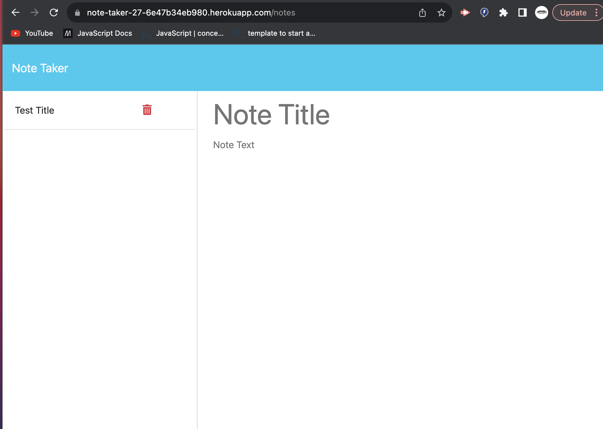

# Note Taker Starter Code

# Note Taker App

## Description
The Note Taker App is a simple web application built using Node.js and Express.js that allows users to create, save, and delete notes. It provides a user-friendly interface for managing notes and stores them in a JSON file for persistence.

## Features
- Create new notes with a title and content.
- Save notes to the server for later reference.
- View a list of saved notes and click on them to see details.
- Delete unwanted notes to keep your list organized.

## Installation
1. Clone this repository to your local machine using `git clone`.
2. Navigate to the project directory using the command line.
3. Run `npm install` to install the required dependencies.
4. Start the server by running `npm start`.
5. Open your web browser and go to `http://localhost:8000` to access the Note Taker App.

## Usage
1. To create a new note, click on the "Note Title" and "Note Text" fields, and enter your title and content.
2. Click the floppy disk icon in the top-right corner to save the note.
3. Saved notes will appear in the left sidebar. Click on a note to view its details.
4. To delete a note, click the trash can icon next to the note in the sidebar.

## API Endpoints
- `GET /api/notes`: Retrieves a list of all saved notes.
- `POST /api/notes`: Creates a new note and saves it to the server.
- `DELETE /api/notes/:id`: Deletes a specific note by its unique ID.

## Technologies Used
- Node.js
- Express.js
- JavaScript
- HTML
- CSS

## Screenshots

## Contributing
Contributions are welcome! Please fork this repository and create a pull request with your changes.

## Author
[Janell Smith]
[jdstar17@gmail.com]

## Acknowledgments
- Special thanks to [tutor: Charles Puente-Matos & youtuber: https://www.youtube.com/watch?v=SyiL0J80gDQ ] for their guidance and support during the development of this project.

## Contact
If you have any questions or suggestions, please feel free to contact us at [jdstar17@gmail.com].

---

Happy note-taking! 📝